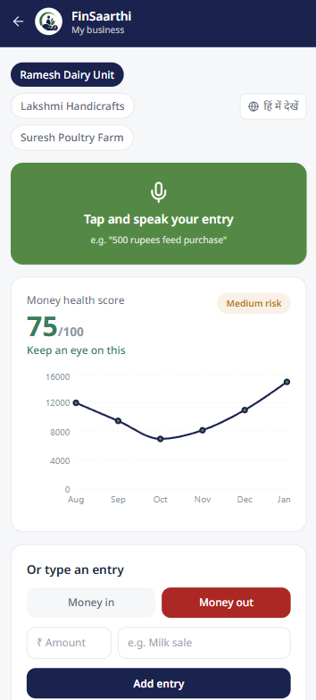
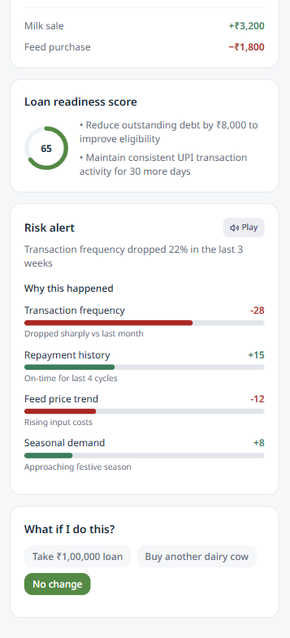
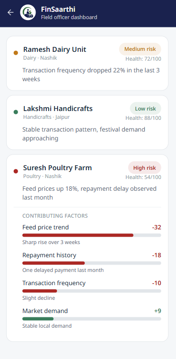
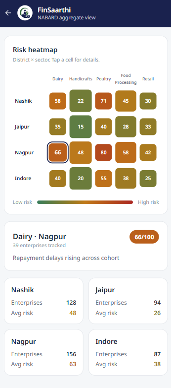

<div align="center">


# FinSaarthi

### From Prediction to Prevention

**AI-Powered Financial Intelligence & Early Warning Platform for Rural Micro Enterprises**

Developed for **NABARD Hackathon 2026**

</div>

---

## Overview

FinSaarthi is an AI-powered financial intelligence platform that helps rural micro enterprises predict financial stress before it becomes a default.

The platform transforms raw financial activity into actionable insights through predictive cash flow forecasting, explainable risk analysis, multilingual voice interaction, and decision-support dashboards. It empowers entrepreneurs, field officers, and institutions such as NABARD to make proactive financial decisions rather than reacting after problems arise.

---

## Key Features

- AI-powered cash flow forecasting
- Early financial risk detection
- Explainable AI insights
- Credit Readiness Score
- What-If financial simulator
- Voice-first multilingual interface
- Enterprise dashboard
- Field officer dashboard
- NABARD analytics dashboard
- District-wise and sector-wise risk heatmaps

---

# Application Preview

## Landing Page

<p align="center">

</p>

---

## Enterprise Dashboard

<p align="center">

</p>

---

## Enterprise Financial Insights

<p align="center">

</p>

---

## Field Officer Dashboard

<p align="center">

</p>

---

## NABARD Aggregate Dashboard

<p align="center">

</p>

---

## Technology Stack

| Category | Technology |
|-----------|------------|
| Frontend | React |
| Build Tool | Vite |
| Styling | Tailwind CSS |
| Charts | Recharts |
| Icons | Lucide React |
| Voice Interface | Web Speech API |
| Dataset | Mock Financial Dataset |

---

## System Workflow

```text
Financial Data
        │
        ▼
Data Processing & Validation
        │
        ▼
AI Risk Assessment Engine
        │
        ├───────────────┐
        │               │
        ▼               ▼
Cash Flow Forecast   Credit Readiness
        │
        ▼
Explainable Insights
        │
        ▼
Decision Support
        │
 ┌──────┼─────────┐
 │      │         │
 ▼      ▼         ▼
Enterprise   Field Officer   NABARD
Dashboard     Dashboard     Dashboard
```

---

## Repository Structure

```text
finsaarthi
│
├── public
├── screenshots
├── src
│   ├── assets
│   ├── App.jsx
│   ├── main.jsx
│   └── mockData.js
│
├── package.json
├── vite.config.js
├── tailwind.config.js
└── README.md
```

---

## Getting Started

Clone the repository

```bash
git clone https://github.com/Mahek2710/finsaarthi.git
```

Navigate to the project

```bash
cd finsaarthi
```

Install dependencies

```bash
npm install
```

Start the development server

```bash
npm run dev
```

---

## Target Users

### Rural Micro Entrepreneurs

- Track business health
- Forecast future cash flow
- Improve loan readiness
- Receive financial recommendations

### Field Officers

- Identify high-risk enterprises
- Understand contributing risk factors
- Prioritize field interventions

### NABARD

- Monitor district-level financial health
- Analyze sector-wise trends
- Enable data-driven policy decisions

---

## Vision

FinSaarthi aims to become the financial intelligence layer for rural lending by enabling:

- Earlier intervention
- Better lending decisions
- Reduced defaults
- Improved financial inclusion
- Sustainable rural economic growth

---

## Team

**Mahek Hingorani**

**Supriya Nayak**

**Akritee Singh**

**Shambhavi Patil**

Developed for **NABARD Hackathon 2026**
